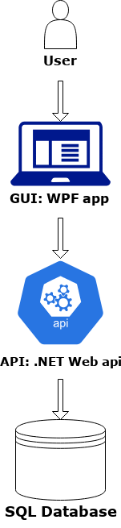

# HotelResAPI


## Kom igång

- Ladda ned repot från github.
- Öppna solution-filen i visual studio 2019.
- Se till att att korrekt sql-server är vald och att [anslutningssträngen](#Konfigurering-av-applikation) är korrekt utformad.
- Kör programmet.


## Komponenter
- Programmet är skrivet i språket C# och i ASP.NET 5.0.  
- Koppling till SQL-databas med hjälp av Entity Framework Core v5.0.10.
- Detta program har följande NuGet-paket installerade:
  - Microsoft.EntityFrameworkCore v5.0.10
  - Microsoft.AspNetCore.Mvc.NewtonsoftJson v5.0.10
  - Microsoft.EntityFrameworkCore.Design v5.0.10
  - Microsoft.AspNetCore.Authentication.JwtBearer v5.0.10
  - Microsoft.EntityFrameworkCore.SqlServer v5.0.9
  - Microsoft.EntityFrameworkCore.Tools v5.0.9
  - Microsoft.VisualStudio.Web.CodeGeneration.Design v5.0.2
- Modell-klasser för att hantera data över många tabeller i databasen.
- Kontroller för att sköta indata och utdata med json.
- Appsettings-singleton ligger i models-mappen och används för att hantera nycklar. Denna är placerad där av organisationsskäl och inte för att den egentligen är en
- programmet är en del av en större arkitektur. Detta är API-delen:



##  För en applikation i produktion

 

### Driftmiljöer för denna applikation

Detta program är färdigt för test-/utvecklingsmiljöer, men koden behöver justeras för produktionssättning. Med Konfigurering (se nästa punkt) och uppladdning till relevant server kan programmet släppas.

### Konfigurering av applikation

Sql-servern och själva databasen behöver ankopplas: I filen filen **appsettings.json** finns i kodblocket och kan se ut såhär:
```
    "ConnectionStrings": 
        { "DefaultConnection": "Server=(localdb)\\MSSQLLocalDB;Database=HotelResDb;Trusted_Connection=True;"
        }
```
 Ändra den strängen till den sträng som kommer att användas i vidare testning och sedan produktion. 
 
 I samma fil finns även hårdkodade nycklar för autentisering. Dessa kan se ut såhär:
 ```
     "AppSettings": {
        "JwtSecret": "ntxadrjjyptewtfrwfenvckdtlxoshlv",
        "GoogleClientId": "<identifikationsnummer>.apps.googleusercontent.com",
        "GoogleClientSecret": "6sIXrnHP-1pK809piNY3XYf2",
        "JwtEmailEncryption": "ntxadrjjyptewtfrwfenvckdtlxoshlv"
 ```
Nycklar bör inte hårdkodas under produktion och framför allt inte lagras i en jsonfil. Använd istället secrets.
---

URL för programmet, samt profiler finns i filen **launchSettings.json** och kan se ut såhär:
```
{
  "$schema": "http://json.schemastore.org/launchsettings.json",
  "iisSettings": {
    "windowsAuthentication": false,
    "anonymousAuthentication": true,
    "iisExpress": {
      "applicationUrl": "http://localhost:42958",
      "sslPort": 44364
    }
  },
  "profiles": {
    "IIS Express": {
      "commandName": "IISExpress",
      "launchBrowser": true,
      "launchUrl": "api/hotels",
      "environmentVariables": {
        "ASPNETCORE_ENVIRONMENT": "Development"
      }
    },
    "HotelResAPI": {
      "commandName": "Project",
      "dotnetRunMessages": "true",
      "launchBrowser": true,
      "launchUrl": "api/hotels",
      "applicationUrl": "https://localhost:5001;http://localhost:5000",
      "environmentVariables": {
        "ASPNETCORE_ENVIRONMENT": "Development"
      }
    }
  }
}

```

---
För test av program med en förpopulerad databas finns en fil som heter DbInitializer.cs. Den kommer att seeda databasen om den är tom. Den bör dock inte användas när projektet produktionssätts.

    
